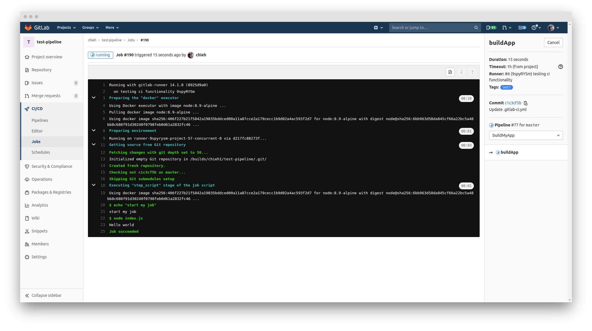
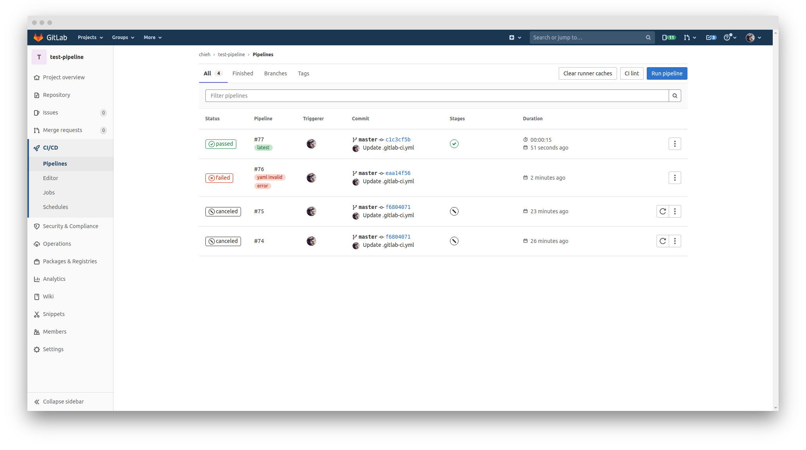
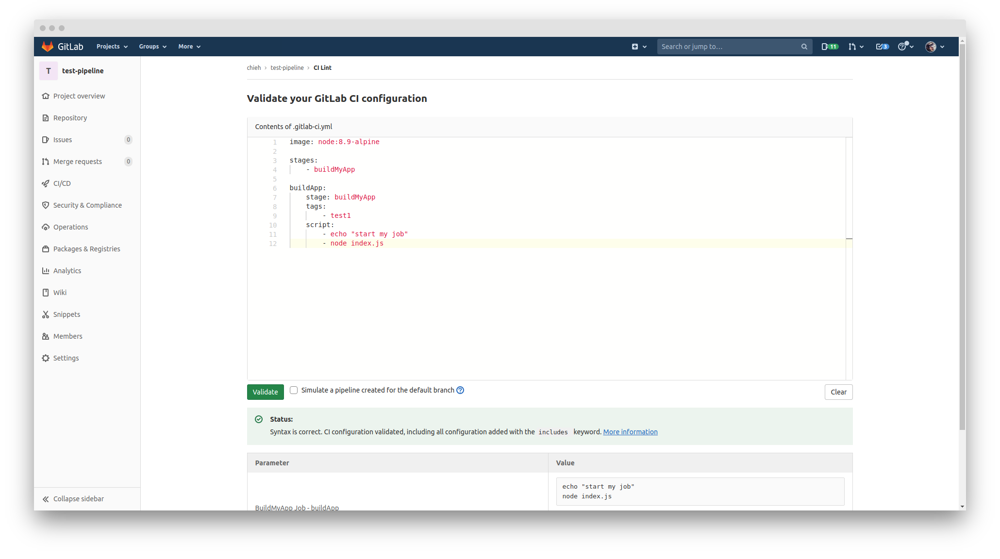
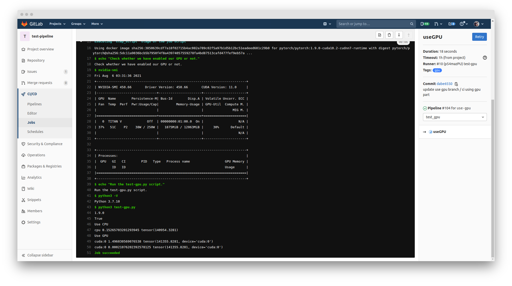

# GitLab CI Pipeline For Deep Learning

## Introduction

Using CI mechanism can highly reduce developers' time that it can achieve building code, generating files, and testing your codes.   

In this repository, I will demonstrate how to do it from scratch and take it on deep learning domain.

To avoid a beginner feeling that is a high learning threshold, I will introduce its workflow and some concepts that will make you more familiar with it. 

**The workflow of manipulating CI:**

Mainly we can separate two parts:

1. first part is creating runner and set up runner. 
2. Second part is to write the CI script like defining your testing / building workflow.

**\* runner**: like a machine, like a people, like an executor, like a worker.

**Notes:**

1. Gitlab server and Gitlab runner can be set in different devices.
2. Gitlab runner can support various OS versions including Linux, MacOS, WIN, etc. It depends on your purpose. [Documents](https://docs.gitlab.com/runner/install/)
3. Suppose the OS of your device is Linux, you can only deploy linux runner on your device and you cannot deploy the Windows runner.
4. We can create a lot of runners, and we use `tags` to control the runner. Each runner can only do one thing at the same time; hence, if you have many tasks or repositories, it is better if you can make more runners.
5. Shared runner can use on different repositories, but Specific runner can only use on one repository.

# Getting Started

- Simple steps : The purpose is to let you complete once CI process including creating a runner and test it by this runner. It is very simple. 
- Advanced CI Rule Mechanism: To set only using CI in the specific branch. We won't own only one branch in a majority of situations for AI developments.
- Connect build and test stages: How to connect multi-stages during CI mechanism and export the files from CI stages.
- Use GPU in the CI stage: Enable GPU in docker containers during CI testing for deep learning 

## Simple Steps

(The steps and commands were followed from [1] and [2] of Reference area.)

1. Create a runner.

Please define the location of your config. 
```
docker run --rm -t -i -v /path/to/config:/etc/gitlab-runner --name gitlab-runner gitlab/gitlab-runner register
```

Here is my example.


Check the "Set up a specific runner manually" area.

```
$ docker run --rm -t -i -v $PWD/config:/etc/gitlab-runner --name gitlab-runner gitlab/gitlab-runner register

Runtime platform                                    arch=amd64 os=linux pid=6 revision=8925d9a0 version=14.1.0
Running in system-mode.                            
                                                   
Enter the GitLab instance URL (for example, https://gitlab.com/):
http://10.1.2.110:5567/
Enter the registration token:
SGdZAexhVWNvVUPKxRwR
Enter a description for the runner:
[aa8c8bee8ea6]: testing ci functionality
Enter tags for the runner (comma-separated):
test1
Registering runner... succeeded                     runner=SGdZAexh
Enter an executor: custom, docker, parallels, shell, ssh, docker+machine, docker-ssh, virtualbox, docker-ssh+machine, kubernetes:
docker
Enter the default Docker image (for example, ruby:2.6):
node:8.9-alpine
Runner registered successfully. Feel free to start it, but if it's running already the config should be automatically reloaded! 
```

Done of registered runner only, and then let's start the runner.

Please change your path of config folder.
```
$ docker run -d --name gitlab-runner --restart always \   
-v $PWD/config:/etc/gitlab-runner \ 
-v /var/run/docker.sock:/var/run/docker.sock \
gitlab/gitlab-runner:latest
d217fc88273f841a9743f97056468c3cc6f91d0d7f5f91d1dee2fd0ceec0bb3d
```
Let's go back to Gitlab repo page that we can see there is a runner.


Done of setting the runner.

Second part is to create a script for gitlab-ci use. 
You can define exact commands inside this script.

2. Create a `.gitlab-ci.yaml` script:
```
image: node:8.9-alpine

stages:
    - buildMyApp
    
buildApp:
    stage: buildMyApp
    tags: 
        - test1
    script:
        - echo "start my job"
        - node index.js
```
(If you create this scirpt in host, then you add this script and commit & push it.)
Then we can go to **CI/CD** area to run pipeline.
We can click it and check in the **job** to see the whole processes.


After it finishes successfully, it will show the *passed* on the status of pipelines.


If your gitlab-ci.yaml format wrong, you can go to **CI lint** of the pipelines page to validate the format.


# Advanced CI Rule Mechanism

Only allow the specific branch to trigger CI mechanism.

Define in the `.gitlab-ci.yml` file.

```
image: node:8.9-alpine

stages:
    - buildMyApp
    
buildApp:
    stage: buildMyApp
    tags: 
        - linux_x64
    script:
        - echo "start my job - here is the branch-test Not master."
        - node index.js
        - cat README.md
    rules:
        - if: $CI_COMMIT_BRANCH == "branch-test"
```

Add the **rules** in that job.

```yml
rules:
        - if: $CI_COMMIT_BRANCH == "branch-test"
```

Of course, if you wanna only trigger CI in master, or default-branch, you can set like this.

```yml
rules:
        - if: $CI_COMMIT_BRANCH == $CI_DEFAULT_BRANCH
```

Or you can use alternative way like below:
```yml
only:
        - (your branch name)
```

# Connect build and test stages

*In this section, I did not prepare any example, but you can try it with your case.*

In this scenario, I have an analysis tool that I request to use `.so` files which are generated from `py` files to compute my analysis.

Hence, I define two stages that first stage is to build the `.so` files and also save these `.so` files on Gitlab server. (we can download it from Gitlab CI/CD area.) Second stage is to take those (.so) files from first stage to compute the analysis. In addition, it can help me to identify which `.so` files can work well or not.    

In this `.gitlab-ci.yml`, it can achieve these things below:

1. Build codes. 
2. Keep the files from CI mechanism on GitLab if the CI stage is success.
3. Take the files of previous stage generated to use in the next stage.
4. Trigger CI on the specific branch.

```yml
image: python:3.6

stages:
    - build
    - test

build-pyd:
    stage: build
    tags: 
        - linux_x64
    script:
        - echo "Start to build (.so) file in linux."
        - chmod +x build.sh
        - ./build.sh
    only:
        - analysis-tool
    artifacts:
        when: on_success
        # expose_as: 'artifact 1'
        paths: ['pyd-files/linux/*.so']

test-analysis-job1:
    stage: test
    tags: 
        - linux_x64
    script:
        - echo "Start to test the analysis of normal case with .so file in linux."
        - python3 -V 
        - python3 test-code/test-analysis.py
        - echo "Done."
    only:
        - analysis-tool
    dependencies:
        - build-pyd
```

You can download the artifact from here if it is able to pass the CI stage.


# Use GPU in the CI stage

> As we know, a majority of jobs ask for GPU on deep learning / AI domain. Hence, let's take a look how to enable the GPU during CI stage.

Mainly we need to add one line in `config.toml` file.

```yml
  [runners.docker]
    gpus = "all"
```

Let's create an newer runner for testing gpu use.

In my `config.toml`, it looks like below:

```yml
concurrent = 1
check_interval = 0

[session_server]
  session_timeout = 1800

[[runners]]
  name = "test-gpu"
  url = "http://10.1.2.110:5567/"
  token = "mazPUEET8A8CZK"
  executor = "docker"
  [runners.custom_build_dir]
  [runners.cache]
    [runners.cache.s3]
    [runners.cache.gcs]
    [runners.cache.azure]
  [runners.docker]
    gpus = "all"
    tls_verify = false
    image = "pytorch/pytorch:1.9.0-cuda10.2-cudnn7-runtime"
    privileged = false
    disable_entrypoint_overwrite = false
    oom_kill_disable = false
    disable_cache = false
    volumes = ["/cache"]
    shm_size = 0
```

After we amend the `config` file of this runner, add one job for dealing with gpu testing. Then let's start it.

```yml
stages:
    - test_gpu

useGPU:
    image: pytorch/pytorch:latest
    stage: test_gpu
    tags: 
        - test-gpu
    script:
        - echo "Check whether we have enabled our GPU or not."
        - nvidia-smi
        - echo "Run the test-gpu.py script."
        - python3 -V
        - python3 test-gpu.py

    rules:
        - if: $CI_COMMIT_BRANCH == "use-gpu"
```

I prepared one script for testing GPU by Pytorch, and we can see the result which used the GPU successfully.



*For this testing, you have to checkout to `use-gpu` branch to test it. Otherwise, you can amend the branch from use-gpu to master in the gitlab-ci.yml file.*

## Reference

1. [[教學] 如何使用Gitlab CI來達到自動化測試與佈署](https://xenby.com/b/178-%E6%95%99%E5%AD%B8-%E5%A6%82%E4%BD%95%E4%BD%BF%E7%94%A8gitlab-ci%E4%BE%86%E9%81%94%E5%88%B0%E8%87%AA%E5%8B%95%E5%8C%96%E6%B8%AC%E8%A9%A6%E8%88%87%E4%BD%88%E7%BD%B2)
2. [[簡易教學] 五分鐘內學會使用Gitlab Pipeline作CI](http://andy51002000.blogspot.com/2019/11/gitlabcicd.html)